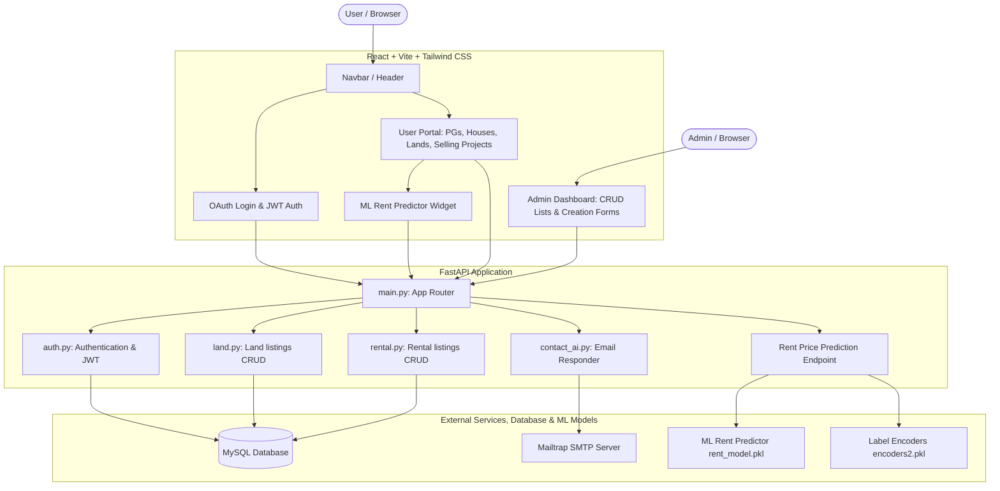

# 🏡 NestHub - AI-Powered Real Estate Platform

A premium, full-stack real estate listing and rental management platform. This project features robust property browsing, user/admin authentication (including Google OAuth), a dynamic admin CRUD dashboard, custom automated AI email responders, and an integrated Machine Learning model to predict rental prices.

---

## 🏗️ System Architecture

The following diagram illustrates the overall system architecture, showing how the frontend React app interacts with the FastAPI backend, MySQL database, and the integrated machine learning model:



---

## ✨ Key Features

### 👤 User Portal
- **Interactive Landing Page**: Modern, dynamic design using **Tailwind CSS v4** and **Framer Motion** transitions (Hero, Featured Projects, Rentals, Land, Testimonials, About Us).
- **Authentication**: Seamless user login supporting standard credential-based login and Google Sign-in via `@react-oauth/google`.
- **Property Listing Views**: Specialized directories with filtering and detail views for **PGs, Co-living, Houses, Apartments, Lands**, and **Properties for Sale**.
- **AI Rent Predictor Calculator**: Interactive calculator widget directly on the landing page for predicting monthly rents.

### ⚙️ Admin Dashboard
- Secure authentication system restricted to admin roles.
- Full CRUD (Create, Read, Update, Delete) capability for **House listings, Land listings, and Rental listings**.
- Native support for property image uploads and server-side storage.

### 🤖 AI & Automation Integration
- **FastMail Auto-Responder**: Whenever a user reaches out via the property contact/submission form, they receive a detailed email checklist outlining properties requirements (title, square footage, amenities, images, etc.). Concurrently, notifications are sent directly to the site administrator.
- **Machine Learning Rent Prediction**: A trained Scikit-Learn model (`rent_model.pkl`) predicts monthly rent prices based on user inputs. The backend performs live feature engineering:
  - $\text{floor\_ratio} = \frac{\text{current\_floor}}{\text{total\_floors} + 1}$
  - $\text{is\_high\_floor} = 1 \text{ if } \text{current\_floor} > (\text{total\_floors} \times 0.5) \text{ else } 0$
  - $\text{bathroom\_per\_bhk} = \frac{\text{bathroom}}{\text{bhk}}$
  - $\text{bhk\_per\_sqft} = \frac{\text{bhk}}{\text{area}}$
  - Encodes categorical properties (furnishing, area type, tenant preference) dynamically using `encoders2.pkl`.

---

## 🛠️ Technology Stack

| Domain | Technologies |
| :--- | :--- |
| **Frontend** | React 19 (Vite), React Router DOM (v7), Tailwind CSS v4, Framer Motion, Axios, `@react-oauth/google` |
| **Backend** | FastAPI, Uvicorn, PyJWT (JWT tokens), Passlib (Bcrypt hashing), Pydantic, FastMail |
| **Machine Learning** | Scikit-Learn, Joblib, Numpy |
| **Database** | MySQL |

---

## 🚀 Installation & Setup Guide

### Prerequisites
Ensure you have the following installed on your machine:
- **Node.js** (v18+)
- **Python** (v3.8+)
- **MySQL Server**

---

### 1. Database Setup
1. Open your MySQL client and run the SQL commands from [table.sql](file:///t:/PROJECTS/estate_project/backend/table.sql) to initialize the database and populate default listings:
   ```bash
   mysql -u root -p < backend/table.sql
   ```
2. By default, the database is named `estate`, and a default administrator account is inserted:
   - **Admin Username**: `estate.co@gmail.com`
   - **Admin Password**: `estate.co123`

---

### 2. Backend Setup
1. Navigate to the backend directory:
   ```bash
   cd backend
   ```
2. Create and activate a python virtual environment:
   ```bash
   python -m venv venv
   # On Windows:
   .\venv\Scripts\activate
   # On macOS/Linux:
   source venv/bin/activate
   ```
3. Install the required Python dependencies:
   ```bash
   pip install fastapi uvicorn mysql-connector-python fastapi-mail pyjwt passlib[bcrypt] python-multipart joblib numpy scikit-learn
   ```
4. Create a `.env` file in the `backend/` directory with the following variables (refer to [.env](file:///t:/PROJECTS/estate_project/backend/.env)):
   ```env
   GOOGLE_CLIENT_ID=your_google_client_id
   GOOGLE_CLIENT_SECRET=your_google_client_secret
   PASSWORD_PEPPER=your_password_pepper_string
   JWT_SECRET=your_jwt_secret_key
   ```
5. Set up your SMTP server in [email_config.py](file:///t:/PROJECTS/estate_project/backend/email_config.py) (default configured to Mailtrap sandbox).
6. Start the FastAPI development server:
   ```bash
   uvicorn main:app --reload
   ```
   The backend will be available at `http://127.0.0.1:8000`.

---

### 3. Frontend Setup
1. Navigate to the frontend directory:
   ```bash
   cd ../frontend
   ```
2. Install the Node.js packages:
   ```bash
   npm install
   ```
3. Create a `.env` file in the `frontend/` directory with the Google OAuth Client ID:
   ```env
   VITE_GOOGLE_CLIENT_ID=your_google_client_id
   ```
4. Start the Vite React development server:
   ```bash
   npm run dev
   ```
   The frontend application will run locally at `http://localhost:5173`.

---

## 📂 Project Structure

```
estate_project/
│
├── backend/
│   ├── models/                # Trained ML pickle files and Jupyter notebooks
│   ├── routers/               # FastAPI route definitions (auth, land, rentals, contact_ai)
│   ├── uploads/               # Admin uploaded house photos
│   ├── images/                # Static property images
│   ├── main.py                # Main FastAPI entry point and ML prediction handlers
│   ├── db.py                  # MySQL database connection module
│   ├── security.py            # Password hashing & JWT token managers
│   ├── email_config.py        # FastMail SMTP connection configuration
│   ├── table.sql              # MySQL database schema setup and seed data
│   └── .env                   # Backend environment variables
│
├── frontend/
│   ├── src/
│   │   ├── assets/            # Static logo icons and images
│   │   ├── components/        # React components (Home, Navbar, Land, Rentals, Admin Panel)
│   │   │   ├── admin/         # Admin views (House/Land/Rental creators and lists)
│   │   │   └── models/        # ML prediction forms (RentPrice, Price)
│   │   ├── App.jsx            # Main dashboard shell
│   │   ├── Routing.jsx        # Routing engine mapping paths and protected route wrappers
│   │   ├── api.jsx            # Axios instance for client HTTP requests
│   │   └── main.jsx           # Frontend entry point
│   ├── package.json           # Node dependencies and npm scripts
│   └── .env                   # Frontend environment variables
│
└── README.md                  # Project overview documentation
```